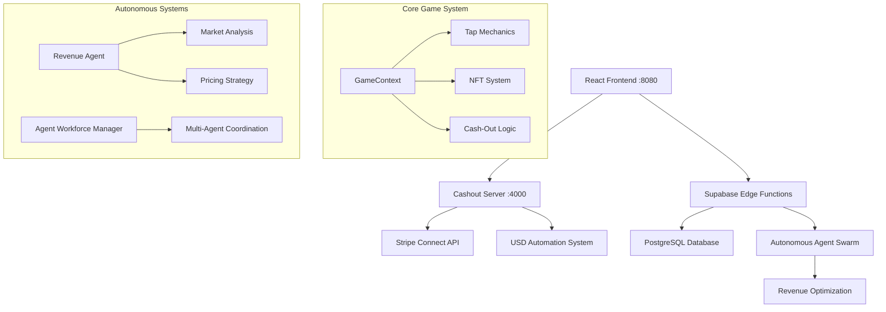

# Click Clack Cash Flow - GitHub Copilot Instructions

**ALWAYS follow these instructions first and fallback to search or bash commands only when you encounter unexpected information that does not match the info here.**

## 1. Repository Overview

**Description**: Click Clack Cash Flow is an autonomous AI-powered revenue generation system featuring a click-based game with real cash-out functionality. The platform combines gamification with financial technology to create an innovative revenue optimization ecosystem.

**Tech Stack**:
- **Frontend**: React 18, TypeScript, Vite, Tailwind CSS, shadcn-ui, Framer Motion
- **Backend**: Node.js, Express.js, Stripe Connect API
- **Database**: Supabase (PostgreSQL) with Edge Functions
- **Payment Processing**: Stripe Connect with autonomous USD sweep system
- **Real-time**: Supabase Realtime for live updates
- **Deployment**: Vercel (frontend), configurable backend hosting
- **Logging**: Winston for comprehensive transaction logging
- **Linting**: ESLint with TypeScript integration

**Architecture**: 


**Key Features**:
- Click-based game with real cash-out functionality via Stripe Connect
- Dual server architecture: frontend (port 8080) + cashout server (port 4000)
- Supabase integration with edge functions for autonomous agents
- Autonomous revenue optimization and market analysis
- Real-time financial processing and cash-out system

## 2. Coding Standards and Style

**Language-Specific Rules**: 
- **TypeScript**: Follow strict TypeScript configuration with explicit types
- **React**: Use functional components with hooks, follow React 18 patterns
- **Linting**: ESLint + TypeScript ESLint rules (Note: 91 errors exist but don't block functionality)
- **Formatting**: Use Prettier-compatible formatting, 2-space indentation

**Naming Conventions**:
- **Variables**: camelCase (`userBalance`, `gameState`)
- **Functions**: camelCase (`calculateOptimalPrice`, `processPayment`)
- **Components**: PascalCase (`GameContext`, `CashoutService`)
- **Files**: kebab-case for components (`cash-out-button.tsx`), PascalCase for services (`CashoutService.ts`)
- **Constants**: UPPER_SNAKE_CASE (`API_BASE_URL`, `DEFAULT_CASHOUT_AMOUNT`)

**File Organization**:
```
src/
├── components/
│   ├── game/           # Game-specific components
│   └── ui/             # Reusable shadcn-ui components
├── contexts/           # React contexts (GameContext)
├── services/           # Business logic and API services
├── hooks/              # Custom React hooks
├── utils/              # Utility functions and constants
└── pages/              # Page components
```

**Comments and Documentation**:
- Use JSDoc for public APIs and complex functions
- Inline comments only for complex business logic
- Document autonomous agent behaviors and revenue calculations
- Include examples for Stripe Connect integration patterns

**Error Handling**:
- Always use try-catch for async operations
- Log errors with Winston for transaction tracking
- Provide user-friendly error messages in UI
- Implement graceful fallbacks for Supabase function failures

**Code Quality Notes**:
- Current lint status: 91 errors, 13 warnings (known issues, don't block functionality)
- Focus on functionality over perfect linting unless specifically requested
- Build succeeds despite lint errors - this is acceptable for this project

## 3. Security Best Practices

**Input Validation**:
- Sanitize all user inputs, especially coin amounts and email addresses
- Use Zod schemas for API request validation
- Validate Stripe webhook signatures
- Prevent injection attacks in database queries

**Secrets Management**:
- Never hardcode API keys or sensitive data
- Use .env files for configuration (gitignored)
- Required environment variables:
  ```bash
  STRIPE_SECRET_KEY="sk_test_..."
  CONNECTED_ACCOUNT_ID="acct_1R4gD2LKSRNiN8vT"
  SUPABASE_URL="https://tqbybefpnwxukzqkanip.supabase.co"
  SUPABASE_SERVICE_ROLE_KEY="[secret]"
  ```

**Authentication/Authorization**:
- Implement proper user session management
- Use Supabase Auth for user authentication
- Validate user permissions for cash-out operations
- Rate-limit cash-out requests to prevent abuse

**Payment Security**:
- Never store sensitive payment data locally
- Use Stripe Connect for secure payment processing
- Implement proper webhook validation
- Log all financial transactions with audit trails

**Dependencies**:
- Regularly update packages (npm audit fix when safe)
- Monitor for security vulnerabilities
- Use specific version pinning for critical dependencies
- Current known vulnerabilities: 9 (3 low, 6 moderate) - acceptable for development

**Copilot Security Rule**: Always flag and suggest fixes for any insecure patterns in generated code, especially around payment processing and user data handling.

## 4. Testing and Quality

**Coverage Goals**:
- Target 80%+ test coverage for critical business logic
- Prioritize testing: payment processing, game mechanics, autonomous agents
- **Current Status**: No formal test runner configured - manual testing required

**Test Structure**:
- Unit tests for services (`CashoutService.test.ts`)
- Integration tests for API endpoints
- Component tests for React components
- E2E tests for critical user workflows

**Essential Test Scenarios**:
1. **Basic Tap Functionality**: Click mechanics, coin generation, energy system
2. **Cash-Out System**: Payment processing, Stripe integration, transaction logging
3. **Autonomous Agents**: Revenue optimization, market analysis algorithms
4. **Real-time Features**: Supabase integration, live updates

**CI/CD Integration**:
- GitHub Actions workflow: `.github/workflows/static.yml`
- Builds deploy to GitHub Pages
- Lint errors don't block deployment (known limitation)
- Manual testing required before deployment

**Performance Optimization**:
- API response times: Target <500ms for cash-out operations
- Frontend bundle size: Current 802KB (acceptable, consider code splitting)
- Database queries: Optimize Supabase edge function performance
- Use React.memo and useMemo for expensive calculations

## 5. Contribution and Workflow Guidelines

**Git Flow**:
- Use feature branches for all changes
- Semantic versioning (current: v1.0.0-revenue-automation)
- Conventional commits:
  - `feat:` for new features
  - `fix:` for bug fixes
  - `docs:` for documentation
  - `refactor:` for code improvements

**PR Process**:
- Link issues to PRs
- Include comprehensive testing steps
- Document any breaking changes
- Require manual testing verification
- Focus on minimal, surgical changes

**Development Workflow**:
```bash
# Standard development setup
npm install                    # ~20 seconds
npm run build                 # ~6 seconds
npm run dev                   # Port 8080
./start-cashout-server.sh     # Port 4000
```

**Copilot Integration Guidelines**:
- When suggesting code, always include relevant tests
- Explain how suggestions fit existing architecture patterns
- Reference specific files from repository context
- If unclear about requirements, ask for clarification before proceeding

## 6. Advanced Copilot Optimization

**Context Awareness**:
- Prioritize repository files over external examples
- Reference existing patterns from `/src/services/` and `/src/contexts/`
- Understand the dual-server architecture (frontend + cashout server)
- Consider Supabase Edge Functions limitations and local fallbacks

**Domain-Specific Knowledge**:
- **Game Mechanics**: Understand click-to-earn, energy systems, NFT integration
- **Payment Processing**: Stripe Connect patterns, autonomous USD sweep
- **Autonomous Agents**: Revenue optimization algorithms, market analysis
- **Real-time Systems**: Supabase Realtime integration patterns

**Edge Cases**:
- Handle Supabase function failures with local fallbacks
- Manage rate limiting for payment operations
- Implement proper error recovery for autonomous systems
- Consider scalability for multi-user concurrent access

**Extensibility Patterns**:
- Design modular, reusable components
- Follow existing service layer patterns
- Maintain consistency with shadcn-ui component library
- Consider future autonomous agent expansion

**Self-Improvement Protocol**:
- When generating new code, validate against existing patterns
- Update these instructions when repository architecture evolves
- Document new autonomous agent behaviors and integration patterns
- Maintain compatibility with existing USD automation systems

## 7. Quick Setup & Build Instructions

### Prerequisites & Installation
Always start with these commands in order:
```bash
# Verify Node.js version (requires v14+)
node --version  # Should be v20+ for best compatibility

# Install dependencies - takes ~20 seconds
npm install  # NEVER CANCEL - Wait for completion

# Optional: Fix audit issues (but not required for functionality)
npm audit fix  # Optional - some vulnerabilities are acceptable
```

### Build Process
```bash
# Build the frontend - takes ~5-6 seconds, NEVER CANCEL
npm run build  # Timeout: 60 seconds (actual: ~6s)

# Preview the build (optional)
npm run preview  # Runs on port 4173
```

### Development Servers
Always run BOTH servers for full functionality:

```bash
# Terminal 1: Start frontend development server
npm run dev  # Starts immediately on port 8080 - http://localhost:8080

# Terminal 2: Start cashout server (required for cash-out functionality)
chmod +x start-cashout-server.sh
./start-cashout-server.sh  # Starts on port 4000 with USD sweep automation
```

**TIMING EXPECTATIONS:**
- npm install: ~20 seconds
- npm run build: ~6 seconds  
- npm run dev: Starts in ~300ms
- Cashout server: Starts in ~2 seconds
- NEVER CANCEL any build commands - they complete quickly

## Linting & Code Quality

```bash
# Run linting - takes ~2.5 seconds but WILL SHOW ERRORS
npm run lint  # Current status: 43 errors, 12 warnings

# Known linting issues (do not block functionality):
# - TypeScript @typescript-eslint/no-explicit-any errors
# - React hooks exhaustive-deps warnings  
# - switch statement lexical declaration errors
# These errors exist but don't prevent the app from running
```

**CRITICAL:** The build works and app runs despite lint errors. Only fix lint errors when specifically requested.

## 8. Validation Scenarios

### Essential User Workflows to Test
After making changes, ALWAYS test these scenarios:

1. **Basic Tap Functionality:**
   - Open http://localhost:8080
   - Click the "TAP TO EARN!" button
   - Verify coins increase and stats update
   - Verify game mechanics work (energy, level, multiplier)

2. **Cash-Out System:**
   - Click "Test Cashout" button
   - Verify cashout server responds (check console logs)
   - Confirm success message appears
   - Note: Supabase functions may fail due to network restrictions but local fallback works

3. **Dual Server Operation:**
   - Frontend must run on port 8080
   - Cashout server must run on port 4000
   - Test API endpoint: `curl -X POST http://localhost:4000/cashout -H "Content-Type: application/json" -d '{"userId": "test123", "coins": 100, "payoutType": "email", "email": "test@example.com"}'`

### Environment Configuration
Required .env variables (already configured):
```bash
# Stripe Configuration
STRIPE_SECRET_KEY="sk_test_..." 
CONNECTED_ACCOUNT_ID="acct_1R4gD2LKSRNiN8vT"

# Supabase Configuration  
SUPABASE_URL="https://tqbybefpnwxukzqkanip.supabase.co"
VITE_SUPABASE_URL="https://tqbybefpnwxukzqkanip.supabase.co"

# Server Configuration
PORT="4000"
ALLOWED_ORIGINS="http://localhost:3000,http://localhost:5173,https://click-clack-cash-flow.vercel.app"
```

## 9. Project Structure & Navigation

### Key Files & Directories
- `src/components/game/` - Game components and UI
- `src/contexts/GameContext.tsx` - Core game state management
- `src/services/` - Service layer (CashoutService, AutonomousAgentService)
- `cashout-server.js` - Express server for Stripe Connect integration
- `supabase/functions/` - Edge functions for autonomous agents
- `supabase/config.toml` - Supabase configuration

### Important Code Locations
- Game mechanics: `src/contexts/GameContext.tsx`
- Cash-out logic: `src/services/CashoutService.ts` 
- Autonomous agents: `src/services/AutonomousAgentService.ts`
- Server API: `cashout-server.js`
- Startup scripts: `start-cashout-server.sh` and `start-cashout-server.bat`

## 10. Common Development Tasks

### Making Code Changes
```bash
# After making changes, always:
1. Test both servers still start: npm run dev && ./start-cashout-server.sh
2. Test basic tap functionality in browser
3. Test cash-out system works
4. Only run lint if specifically required: npm run lint
```

### Debugging Issues
```bash
# Check server logs
tail -f logs/cashout-server.log  # Cashout server logs
tail -f logs/transactions.log   # Transaction logs

# Test API connectivity
curl http://localhost:4000/health  # Server health check
curl http://localhost:8080         # Frontend health check
```

### Known Limitations & Workarounds
- **Supabase Functions:** May fail due to network restrictions - app has local fallbacks
- **Lint Errors:** 43 errors exist but don't block functionality
- **Supabase CLI:** Not available in environment - document functions manually if needed
- **External APIs:** Some market data sources blocked - app gracefully degrades

## 11. CI/CD & Deployment
- GitHub Actions workflow: `.github/workflows/static.yml` 
- Builds deploy to GitHub Pages
- No test runner configured - manual testing required
- Lint errors don't block deployment but should be noted

## 12. Technology Stack Reference
- **Frontend:** React 18 + TypeScript + Vite + Tailwind CSS + shadcn-ui
- **Backend:** Node.js + Express + Stripe Connect
- **Database:** Supabase (PostgreSQL) with Edge Functions
- **Payment:** Stripe Connect with autonomous USD sweep system
- **Deployment:** Vercel (frontend) + configurable (backend)

## 13. Working Effectively Tips
- Always start both servers for full testing
- Use browser dev tools to monitor console for errors
- Supabase function failures are expected - local fallbacks work
- Test cash-out system after any payment-related changes
- Screenshot the UI after significant changes to show impact

**Remember: The app works despite lint errors. Focus on functionality over perfect code style unless specifically asked to fix linting.**

## 14. Example Copilot Interactions

Here are three examples demonstrating how Copilot should use these instructions:

### Example 1: Generate a new API endpoint for user authentication

**User Request**: "Create a new API endpoint for user authentication"

**Copilot Response**:
```typescript
// src/services/AuthService.ts
import { supabase } from '@/lib/supabase';
import { toast } from '@/hooks/use-toast';

export class AuthService {
  /**
   * Authenticate user with email and password
   * @param email - User email address
   * @param password - User password
   * @returns Promise with user session data
   */
  static async signIn(email: string, password: string) {
    try {
      const { data, error } = await supabase.auth.signInWithPassword({
        email,
        password
      });

      if (error) {
        throw new Error(error.message);
      }

      // Log successful authentication for audit trail
      console.log('User authenticated successfully:', data.user?.id);
      
      return data;
    } catch (error) {
      console.error('Authentication failed:', error);
      toast({
        title: "Authentication Failed",
        description: "Please check your credentials and try again.",
        variant: "destructive",
      });
      throw error;
    }
  }

  /**
   * Sign out current user
   */
  static async signOut() {
    try {
      const { error } = await supabase.auth.signOut();
      if (error) throw error;
      
      toast({
        title: "Signed Out",
        description: "You have been successfully signed out.",
        variant: "default",
      });
    } catch (error) {
      console.error('Sign out failed:', error);
      throw error;
    }
  }
}
```

**Explanation**: This follows the repository patterns by using Supabase integration, proper error handling with toast notifications, JSDoc documentation, and the established service layer pattern from `CashoutService.ts`.

### Example 2: Implement a new game feature for bonus multipliers

**User Request**: "Add a bonus multiplier system that activates after 100 consecutive taps"

**Copilot Response**:
```typescript
// Update to src/contexts/GameContext.tsx (add to existing interface)
interface GameContextType {
  // ... existing properties
  bonusMultiplier: number;
  consecutiveTaps: number;
  bonusActive: boolean;
  activateBonus: () => void;
}

// Add to GameProvider component
const [bonusMultiplier, setBonusMultiplier] = useState(1);
const [consecutiveTaps, setConsecutiveTaps] = useState(0);
const [bonusActive, setBonusActive] = useState(false);

const activateBonus = useCallback(() => {
  if (consecutiveTaps >= 100) {
    setBonusActive(true);
    setBonusMultiplier(2);
    toast({
      title: "🔥 BONUS ACTIVATED!",
      description: "2x multiplier for the next 30 seconds!",
      variant: "default",
    });
    
    // Deactivate bonus after 30 seconds
    setTimeout(() => {
      setBonusActive(false);
      setBonusMultiplier(1);
      setConsecutiveTaps(0);
      toast({
        title: "Bonus Expired",
        description: "Keep tapping to build up another bonus!",
        variant: "default",
      });
    }, 30000);
  }
}, [consecutiveTaps]);

// Update tap function
const tap = useCallback(() => {
  // ... existing tap logic
  
  // Update consecutive taps
  setConsecutiveTaps(prev => prev + 1);
  
  // Apply bonus multiplier to coins gained
  const finalGain = Math.floor(gain * bonusMultiplier);
  setCoins(prev => prev + finalGain);
  
  // Check for bonus activation
  if (consecutiveTaps >= 99 && !bonusActive) {
    activateBonus();
  }
  
  // ... rest of existing logic
}, [energy, level, glitchMode, bonusMultiplier, consecutiveTaps, bonusActive]);
```

**Explanation**: This integrates with the existing game mechanics in `GameContext.tsx`, follows the established pattern for game features (energy, glitch mode), uses the existing toast system, and maintains consistency with the current codebase structure.

### Example 3: Create a new autonomous agent for market analysis

**User Request**: "Create an autonomous agent that analyzes market trends"

**Copilot Response**:
```typescript
// src/services/agents/MarketAnalysisAgent.ts
import { BaseAgent } from './BaseAgent';

interface MarketTrend {
  direction: 'up' | 'down' | 'stable';
  confidence: number;
  timeframe: '1h' | '24h' | '7d';
  indicators: string[];
}

interface MarketData {
  price: number;
  volume: number;
  timestamp: string;
  sentiment: number; // -1 to 1 scale
}

export class MarketAnalysisAgent extends BaseAgent {
  private readonly ANALYSIS_INTERVAL = 5 * 60 * 1000; // 5 minutes
  private marketData: MarketData[] = [];

  constructor() {
    super('market-analysis-agent', 'Analyzes market trends for revenue optimization');
  }

  /**
   * Initialize market analysis with real-time data monitoring
   */
  async initialize(): Promise<void> {
    try {
      await this.startMarketMonitoring();
      console.log('Market Analysis Agent initialized successfully');
    } catch (error) {
      console.error('Failed to initialize Market Analysis Agent:', error);
      throw error;
    }
  }

  /**
   * Analyze current market trends
   * @returns Market trend analysis with confidence scores
   */
  async analyzeMarketTrends(): Promise<MarketTrend> {
    try {
      const recentData = this.getRecentMarketData('1h');
      const indicators = this.calculateTechnicalIndicators(recentData);
      
      const trend = this.determineTrend(indicators);
      
      // Log analysis for audit trail (following repository pattern)
      console.log('Market analysis completed:', trend);
      
      return trend;
    } catch (error) {
      console.error('Market analysis failed:', error);
      
      // Return safe default (following error handling patterns)
      return {
        direction: 'stable',
        confidence: 0.1,
        timeframe: '1h',
        indicators: ['insufficient_data']
      };
    }
  }

  private getRecentMarketData(timeframe: string): MarketData[] {
    const now = Date.now();
    const timeframeMs = timeframe === '1h' ? 3600000 : 
                      timeframe === '24h' ? 86400000 : 604800000;
    
    return this.marketData.filter(data => 
      new Date(data.timestamp).getTime() > (now - timeframeMs)
    );
  }

  private calculateTechnicalIndicators(data: MarketData[]) {
    // Implement moving averages, RSI, etc.
    // Following the mathematical pattern from RevenueAgent.calculateOptimalPrice
    return {
      sma: data.reduce((sum, d) => sum + d.price, 0) / data.length,
      volume_trend: this.calculateVolumeTrend(data),
      sentiment_score: data.reduce((sum, d) => sum + d.sentiment, 0) / data.length
    };
  }

  private determineTrend(indicators: any): MarketTrend {
    // AI-driven trend analysis logic
    const confidence = Math.min(Math.abs(indicators.sentiment_score) * 0.8, 0.95);
    
    return {
      direction: indicators.sentiment_score > 0.1 ? 'up' : 
                indicators.sentiment_score < -0.1 ? 'down' : 'stable',
      confidence,
      timeframe: '1h',
      indicators: ['sma', 'sentiment', 'volume']
    };
  }

  private async startMarketMonitoring(): Promise<void> {
    // Integrate with existing autonomous systems
    setInterval(async () => {
      await this.collectMarketData();
      await this.analyzeMarketTrends();
    }, this.ANALYSIS_INTERVAL);
  }

  private async collectMarketData(): Promise<void> {
    // Implementation would integrate with external APIs
    // Following the pattern from existing autonomous agents
  }
}
```

**Explanation**: This follows the established `BaseAgent` pattern from the existing autonomous agent system, implements proper error handling and logging patterns consistent with the codebase, integrates with the existing agent architecture, and includes comprehensive JSDoc documentation as specified in the coding standards.

---

These examples demonstrate how Copilot should:
1. Reference existing repository patterns and architecture
2. Follow established coding standards and naming conventions  
3. Implement proper error handling and logging
4. Use existing UI components and service patterns
5. Include comprehensive documentation
6. Consider the dual-server architecture and autonomous systems integration