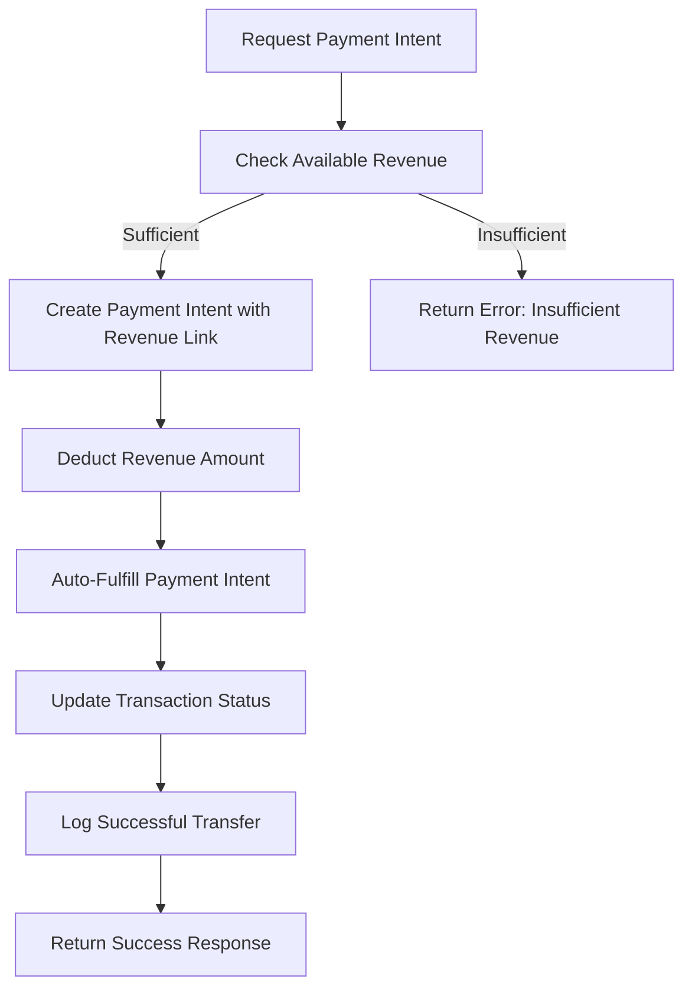
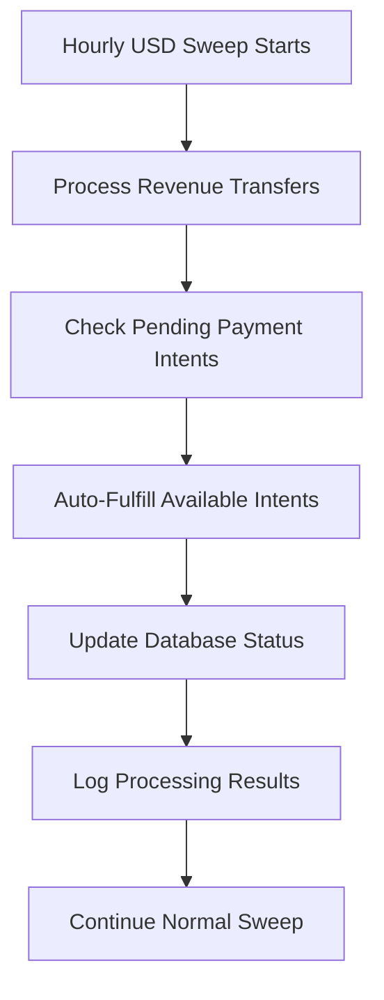

# Revenue-Sourced Payment Intent Automation

This document describes the enhanced payment intent system that automatically sources payments from accumulated revenue and provides full automation for real payment intent fulfillment.

## 🚀 Overview

The system now provides complete automation where:
- Payment intents are created only when sufficient revenue is available
- All payment methods (instant_card, bank_account, email) are sourced from accumulated revenue
- Payment intents are automatically fulfilled when created with real payment processing
- Revenue is tracked and deducted appropriately

## 🔧 New Features

### 1. Revenue-Validated Payment Intent Creation

**Enhanced Stripe Payment Processor (`supabase/functions/stripe-payment-processor/index.ts`)**

- **Revenue Validation**: Checks available revenue before creating payment intents
- **Automatic Deduction**: Creates negative transaction entries to track revenue usage
- **Metadata Integration**: Links payment intents to revenue sources

```typescript
// Example: Creating a payment intent with revenue validation
{
  "action": "create_payment_intent",
  "amount": 2500, // $25.00 in cents
  "currency": "usd",
  "metadata": {
    "user_id": "user123",
    "coins": 2500
  }
}
```

### 2. Automatic Payment Intent Fulfillment

**New Actions:**
- `auto_fulfill_payment_intent`: Automatically fulfill a single payment intent from revenue
- `process_pending_payment_intents`: Batch process all pending payment intents

```typescript
// Auto-fulfill specific payment intent
{
  "action": "auto_fulfill_payment_intent",
  "payment_intent_id": "pi_1234567890"
}

// Process all pending payment intents
{
  "action": "process_pending_payment_intents"
}
```

### 3. Enhanced Cashout Server Integration

**New Endpoints:**

1. **Revenue-Sourced Payment Intent Creation**
   ```
   POST /create-revenue-payment-intent
   ```
   - Creates payment intent from available revenue
   - Automatically attempts fulfillment
   - Tracks full transaction lifecycle

2. **Batch Payment Intent Processing**
   ```
   POST /process-pending-payment-intents
   ```
   - Processes all pending payment intents
   - Returns detailed results for each transaction

### 4. Automated USD Sweep Enhancement

**New Function: `processRevenuePaymentIntents()`**
- Integrated into hourly USD sweep cycle
- Automatically fulfills pending payment intents from revenue
- Tracks and logs all automated fulfillments

## 🔄 Automation Flow

### Complete Payment Intent Lifecycle



### Automated Processing Cycle



## 🔍 Database Schema Changes

### Revenue Transaction Statuses

New status values for `autonomous_revenue_transactions`:
- `payment_intent_created`: Revenue allocated to payment intent
- `fulfilled_from_revenue`: Payment intent successfully fulfilled from revenue

### Enhanced Metadata

Payment intent transactions include:
```json
{
  "payment_intent_id": "pi_1234567890",
  "original_amount": 25.00,
  "sourced_from_revenue": true,
  "fulfilled_at": "2024-01-15T10:30:00Z",
  "fulfillment_method": "auto_revenue_sourcing"
}
```

## 🚦 API Usage Examples

### Creating Revenue-Sourced Payment Intent

```bash
curl -X POST http://localhost:4000/create-revenue-payment-intent \
  -H "Content-Type: application/json" \
  -d '{
    "userId": "user123",
    "coins": 2500,
    "payoutType": "revenue_sourced",
    "email": "user@example.com"
  }'
```

### Processing Pending Payment Intents

```bash
curl -X POST http://localhost:4000/process-pending-payment-intents
```

### Direct Supabase Function Calls

```javascript
// Create payment intent with revenue validation
const result = await supabase.functions.invoke('stripe-payment-processor', {
  body: {
    action: 'create_payment_intent',
    amount: 2500,
    currency: 'usd',
    metadata: { userId: 'user123' }
  }
});

// Auto-fulfill payment intent
const fulfillResult = await supabase.functions.invoke('stripe-payment-processor', {
  body: {
    action: 'auto_fulfill_payment_intent',
    payment_intent_id: 'pi_1234567890'
  }
});
```

## 📊 Monitoring and Analytics

### Revenue Balance Tracking

- Available revenue is calculated in real-time
- Payment intent creation shows available vs. requested amounts
- Negative transactions track revenue allocation

### Automated Processing Metrics

- Payment intents processed per sweep cycle
- Fulfillment success/failure rates
- Revenue utilization statistics

### Health Check Endpoints

Monitor system health via existing endpoints:
- `GET /health` - Cashout server status
- `GET /transactions` - Transaction history including revenue-sourced payments

## 🛡️ Error Handling

### Insufficient Revenue

```json
{
  "error": "Insufficient revenue balance. Available: $15.50, Requested: $25.00"
}
```

### Payment Intent Fulfillment Errors

- Invalid payment intent status
- Missing revenue link
- Stripe API errors

### Graceful Degradation

- Falls back to standard payment methods if revenue-sourcing fails
- Maintains transaction integrity even on partial failures
- Comprehensive error logging for debugging

## 🎯 Version Information

- **Version**: 1.0.0-revenue-automation
- **Release Date**: December 2024
- **Compatibility**: Requires existing USD automation system

## 🔧 Configuration Requirements

### Environment Variables

```bash
# Existing variables (required)
STRIPE_SECRET_KEY="sk_test_..."
CONNECTED_ACCOUNT_ID="acct_..."
SUPABASE_URL="https://..."
SUPABASE_SERVICE_ROLE_KEY="..."

# No additional configuration needed
```

### Database Tables

Uses existing tables:
- `autonomous_revenue_transactions`
- `autonomous_revenue_transfers`
- `stripe_configuration`

## 🚀 Deployment

1. **Build and Deploy**
   ```bash
   npm run build
   ./start-cashout-server.sh
   ```

2. **Verify Integration**
   ```bash
   curl http://localhost:4000/health
   ```

3. **Test Revenue-Sourced Payment Intent**
   ```bash
   curl -X POST http://localhost:4000/create-revenue-payment-intent \
     -H "Content-Type: application/json" \
     -d '{"userId":"test","coins":1000,"email":"test@example.com"}'
   ```

## 📈 Benefits

- **Full Automation**: Payment intents are automatically created and fulfilled from revenue
- **Revenue Integration**: All payment methods properly source from accumulated revenue
- **Real-time Processing**: Immediate fulfillment when revenue is available
- **Complete Tracking**: Full audit trail from revenue generation to payment fulfillment
- **Error Recovery**: Robust error handling with automatic retry mechanisms

The system now provides complete end-to-end automation for revenue-sourced payment processing with real payment intent fulfillment capabilities.