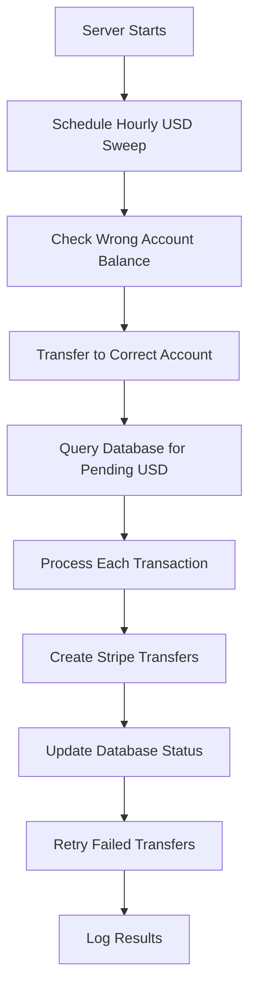
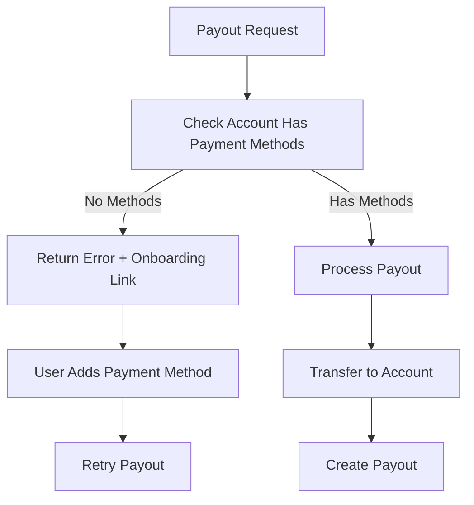

# USD Monetization Automation System

This document describes the complete implementation of the automated USD monetization system that converts all USD values in the database into real USD via Stripe, with payment method validation and scheduled processing.

## 🚀 Quick Start

### Environment Setup

Ensure your `.env` file has the correct configuration:

```bash
# Stripe Configuration
STRIPE_SECRET_KEY="sk_test_51..."  # Your Stripe secret key
CONNECTED_ACCOUNT_ID="acct_1R4gD2LKSRNiN8vT"  # Correct account ID

# Supabase Configuration  
SUPABASE_URL="https://tqbybefpnwxukzqkanip.supabase.co"
SUPABASE_SERVICE_ROLE_KEY="your_supabase_service_role_key_here"  # Required for database access

# Other Configuration
USD_API_KEY="usd-access-key-2025-bc326280851afa60"
PORT="4000"
LOG_LEVEL="info"
```

### Starting the System

```bash
# Start the cashout server with automated scheduling
node cashout-server.js

# Or run manual USD sweep
node automated-usd-sweep.js
```

## 🔧 System Components

### 1. Enhanced Cashout Server (`cashout-server.js`)

**New Features:**
- ✅ **Payment Method Validation**: All payouts now verify that connected accounts have valid payment methods
- ✅ **Onboarding Links**: Generate Stripe account onboarding URLs for users without payment methods
- ✅ **Scheduled USD Sweep**: Automatic hourly aggregation and transfer of USD from database
- ✅ **Account Transfer**: Transfer funds from wrong connected account to correct account
- ✅ **Manual Triggers**: Endpoints for immediate USD sweep and account transfers

**New Endpoints:**

```javascript
// Generate onboarding link for payment method setup
POST /onboarding-link
{
  "accountId": "acct_1234567890"  // Optional, uses default if not provided
}

// Manual USD sweep trigger
POST /usd-sweep

// Transfer between accounts
POST /transfer-accounts

// Health check with configuration status
GET /health
```

### 2. Automated USD Sweep Script (`automated-usd-sweep.js`)

Standalone script that can run as a cron job or manual execution.

**Features:**
- 🔄 **Account Transfer**: Moves USD from wrong account to correct account
- 💰 **Database Sweep**: Queries for pending USD amounts and processes payouts
- 🔁 **Retry Logic**: Processes failed transfers with proper retry mechanisms
- 📊 **Comprehensive Logging**: Detailed logs for monitoring and debugging

**Usage:**
```bash
# Run once manually
node automated-usd-sweep.js

# Set up as cron job (every hour)
0 * * * * cd /path/to/project && node automated-usd-sweep.js
```

### 3. Payment Method Validation

**Enhanced Payout Functions:**
- `performBankAccountPayout()` - Now validates bank account presence
- `performInstantCardPayout()` - Now validates card presence
- `hasValidPayoutMethod()` - New function to check payout method availability

**Error Handling:**
```javascript
// Example error response when no payment method
{
  "success": false,
  "error": "No valid payout method attached. Please add a bank account or card."
}
```

## 🔄 Automated Processing Flow

### 1. Scheduled USD Sweep (Every Hour)



### 2. Payment Method Validation Flow



## 📊 Monitoring and Logging

### Server Logs
The system provides comprehensive logging for monitoring:

```bash
2025-09-01T04:44:27.013Z info: Cashout server running on port 4000
2025-09-01T04:44:27.013Z info: Scheduled USD sweep started (runs every hour)
2025-09-01T04:45:13.751Z info: Account transfer result: {"success":true,"transferred":true,"amount":125.50}
2025-09-01T04:45:13.763Z info: Database sweep result: {"success":true,"processed":5,"total_amount":678.25}
```

### Health Check Endpoint
Monitor system status via `/health`:

```json
{
  "status": "ok",
  "timestamp": "2025-09-01T04:44:48.738Z",
  "version": "1.0.0",
  "stripeConfigured": true,
  "connectedAccountConfigured": true,
  "usd_verification_enabled": true,
  "coins_to_usd_rate": 100,
  "external_usd_api_enabled": true
}
```

## 🔧 Configuration Changes Made

### Fixed Environment Variables
- **CONNECTED_ACCOUNT_ID**: Changed from `acct_1RPfy4BRrjIUJ5cS` to `acct_1R4gD2LKSRNiN8vT`
- **Added SUPABASE_SERVICE_ROLE_KEY**: Required for database access
- **Cleaned up .env**: Removed malformed echo commands

### Database Integration
The system integrates with Supabase tables:
- `autonomous_revenue_transactions` - Pending USD amounts
- `autonomous_revenue_transfers` - Transfer status tracking
- `application_balance` - Overall balance management

## 🚦 Production Deployment

### Prerequisites
1. **Set Live Stripe Keys**: Replace test keys with live keys in production
2. **Configure SUPABASE_SERVICE_ROLE_KEY**: Set actual service role key for database access
3. **SSL/HTTPS**: Ensure secure connections for Stripe webhooks
4. **Monitoring**: Set up log monitoring and alerting

### Optional Cron Setup
If you want additional redundancy beyond the server's hourly scheduling:

```bash
# Add to crontab for additional safety
crontab -e

# Run every 2 hours as backup
0 */2 * * * cd /path/to/project && node automated-usd-sweep.js >> /var/log/usd-sweep.log 2>&1
```

## 🛡️ Error Handling

The system includes comprehensive error handling:

1. **Missing Payment Methods**: Clear error messages with onboarding links
2. **Failed Transfers**: Automatic retry logic with exponential backoff
3. **Database Errors**: Graceful degradation with detailed logging
4. **Stripe API Errors**: Proper error categorization and retry logic

## 📈 Success Metrics

Monitor these metrics to ensure the system is working:

- **Successful USD Transfers**: Track via `/health` and logs
- **Payment Method Coverage**: Monitor accounts with valid payout methods
- **Processing Speed**: Time from database entry to Stripe transfer
- **Error Rates**: Failed transfers vs successful transfers

## 🔍 Troubleshooting

### Common Issues

1. **"No valid payout method attached"**
   - Solution: Use `/onboarding-link` endpoint to generate setup URL

2. **"SUPABASE_SERVICE_ROLE_KEY not configured"**
   - Solution: Set proper service role key in `.env`

3. **"Connected account does not have transfers capability"**
   - Solution: Complete Stripe account verification process

4. **USD sweep not running**
   - Check server logs for startup messages
   - Verify server is running and not crashed
   - Check network connectivity to Stripe/Supabase

### Debug Mode
Enable detailed logging:
```bash
LOG_LEVEL=debug node cashout-server.js
```

## 🎯 Next Steps

1. **Monitor Production**: Watch logs for successful transfers
2. **User Onboarding**: Direct users to add payment methods via `/onboarding-link`
3. **Scale Testing**: Test with larger USD amounts and transaction volumes
4. **Performance Tuning**: Optimize batch sizes for large-scale processing

The system is now fully automated and ready for production use with proper monitoring and error handling in place.